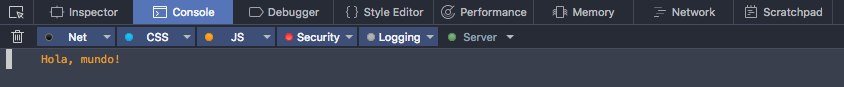
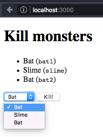
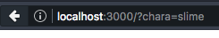
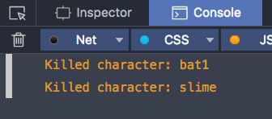
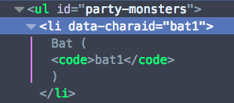
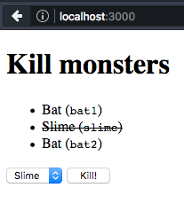

# Ejercicios

Realiza estos ejercicios en orden y trata de responder a las preguntas que se plantean.

Recuerda que puedes consultar la documentación (por ejemplo, [la MDN](http://developer.mozilla.org)), realizar búsquedas en Internet, etc.

**Importante**: en cada ejercicio se pedirá que crees un archivo HTML, otro de JavaScript y quizás uno de CSS. **Debes crear archivos nuevos**, y no reutilizar los de ejercicios anteriores. Si quieres conservar los archivos de los ejercicios, puedes crear un directorio diferente para cada uno.

## Ejercicio 1. Ejecutar JavaScript en el navegador

Crea un fichero `index.html` con el siguiente contenido:

```html
<html>
<head>
    <title>Ejercicios</title>
    <meta charset="utf-8">
    <script src="main.js"></script>
</head>
<body>
</body>
</html>
```

Crea también `main.js` (si te fijas, lo incluimos desde el fichero HTML con la etiqueta `<script>`) con lo siguiente:

```javascript
console.log("Hola, mundo!");
```

Abre el archivo en el navegador, y verás que aparece en blanco –porque el HTML está vacío. Pero si abrimos **la consola del navegador**, podremos ver el mensaje que hemos escrito desde el archivo JavaScript.

En Firefox Developer Edition, puedes abrir las herramientas de desarrollo con `Ctrl + Shift + I` (o `⌘ + ⌥ + I` ), o bien desde el menú `Tools / Web Developer / Toggle Tools`. Aparecerán varios paneles con distintas herramientas, entre ellas, la **consola**, que puedes activar haciendo clic en su pestaña.



Vamos ahora a modificar el HTML dinámicamente para que aparezca texto escrito en la pantalla.

Añade lo siguiente al archivo de JavaScript `main.js`:

```javascript
document.body.innerHTML = '<h1>Hola, mundo!</h1>';
```

Prueba a recargar… ¡y sigue la página en blanco! Sin embargo, si cambiamos la línea anterior por el siguiente bloque, el problema se resuelve:

```javascript
window.onload = function () {
    document.body.innerHTML = '<h1>Hola, mundo!</h1>';
};
```


---

**Pregunta**: ¿Por qué sucede esto?

Recursos:

- [`window.onload`](https://developer.mozilla.org/en/docs/Web/API/GlobalEventHandlers/onload) (MDN)

## Ejercicio 2. Invocar a una horda de gatos

Este ejercicio consiste en crear una imagen al vuelo cuando se pulsa un botón, y añadirla a la página.

Crea un `index.html`:

```html
<html>
<head>
    <title>Ejercicios</title>
    <meta charset="utf-8">
    <script src="main.js"></script>
</head>
<body>
    <h1>Fear the horde!</h1>
    <p><button type="button" id="summon">Summon cat</button></p>
    <p id="kittens"></p>
</body>
</html>
```

Ahora `main.js`. Primero vamos a detectar clicks en el botón:

```javascript
window.onload = function () {
    var button = document.getElementById('summon');
    button.addEventListener('click', function () {
        console.log('Summon!');
    });
};
```

Ejecuta el código en el navegador, y comprueba que el mensaje de `Summon!` aparece en la consola.

Una vez que tenemos el evento detectado, vamos a crear una imagen dinámicamente y añadirla al DOM para que se vea por pantalla. Reemplaza el contenido de la función de _callback_ (la línea que imprimía en la consola) por lo siguiente:

```javascript
var img = new Image();
img.src = 'https://placekitten.com/g/200/200/';
document.getElementById('kittens').appendChild(img);
```

Comprueba que se inserta una imagen nueva con cada click en el botón:


---

**Ejercicio**: en vez de crear un objeto `Image`, modifica el código para insertar HTML directamente como contenido del párrafo con `id` `kittens`.

Recursos:

- [`Element.innerHTML`](https://developer.mozilla.org/en-US/docs/Web/API/Element/innerHTML) (MDN)
- [``](https://developer.mozilla.org/en-US/docs/Web/HTML/Element/img) (MDN)

Consideraciones:

- Recuerda que `innerHTML` es una propiedad tanto de lectura como de escritura.
- Puedes concatenar _strings_ usando el operador `+`. Ej: `'hola, ' + 'mundo'`.
- En este caso, usar `Image` respecto a crear el elemento vía HTML no nos da ninguna ventaja. Se suele utilizar `Image` cuando necesitamos subscribinos a algún elemento de esta (p. ej: `load`), o necesitamos acceder a sus propiedades vía JavaScript.

## Ejercicio 3. Estilos, formularios y atributos personalizados

En este ejercicio vamos a mostrar una lista de personajes y utilizaremos un formulario para seleccionar a cual queremos "matar". Además, mostraremos los personajes muertos con una apariencia diferente.

### Paso 1. Setup

Partiremos del siguiente archivo HTML:

```html
<!doctype html>
<html>
<head>
    <title>Ejercicios</title>
    <meta charset="utf-8">
    <link rel="stylesheet" href="styles.css" type="text/css">
    <script src="main.js"></script>
</head>
<body>
    <h1>Kill monsters</h1>
    <ul id="party-monsters">
    </ul>
    <form name="killing-machine">
        <p>
            <select name="chara"></select>
            <button type="submit">Kill!</button>
        </p>
    </form>
</body>
</html>
```

Crearemos además `styles.css` con lo siguiente:

```css
.dead {
    text-decoration: line-through;
}
```

### Paso 2. Insertar contenido dinámicamente

Este paso lo haremos con JavaScript desde un archivo `main.js`. Lo que haremos será rellenar la lista de personajes con los datos de una _party_, así como personalizar el control de dropdown del formulario (el `<select>`) para que muestre la lista de personajes también.

Primero crearemos los datos de la _party_. Por ejemplo:

```javascript
var party = [
    {name: 'Bat', id: 'bat1'},
    {name: 'Slime', id: 'slime'},
    {name: 'Bat', id: 'bat2'}
];
```

Con esto ya podemos rellenar la lista `<ul>`:

```javascript
window.onload = function () {
    var list = document.getElementById('party-monsters');
    party.forEach(function (character) {
        var li = document.createElement('li');
        li.innerHTML = character.name + ' (<code>' + character.id + '</code>)';
        list.appendChild(li);
    });
};
```

Para añadir "líneas" al control de dropdown, `<select>`, debemos utilizar elementos `<option>`. El texto contenido en la etiqueta será el mostrado en el menú. Sin embargo, para conocer el _valor_ seleccionado, debemos añadir un atributo `name` a `<option>`, y esa _string_ es la que nos devolverá el elemento `<select>` cuando le preguntemos qué opción tiene seleccionada.

Este sería el HTML de ejemplo de un `<select>` (no lo copies, es sólo un ejemplo):

```html
<select name="size">
    <option value="size-s">Small</option>
    <option value="size-m">Medium</option>
    <option value="size-l">Large</option>
</select>
```

Si el usuario seleccionara la opción `Medium`, el `<select>` nos devolvería el valor `size-m` cuando le preguntemos por la opción seleccionada.

Ahora que sabemos esto, vamos a generar un `<select>` que contenga los personajes de la _party_. Utilizaremos el nombre como texto a mostrar, y la ID como valor para esa opción.

```javascript
var select = document.querySelector('select[name=chara]');
party.forEach(function (character) {
    var option = document.createElement('option');
    option.innerHTML = character.name;
    option.value = character.id;
    select.appendChild(option);
});
```

Si ejecutas el código, verás lo siguiente:



Visualmente parece que está todo correcto, pero vamos a comprobar que las `<option>` tienen efectivamente el `value` que queremos.

Para ello, haz click con el botón derecho sobre el `<select>` y selecciona la opción `Inspect Element` del menú contextual. Se abrirán las developer tools (si no estaban abiertas ya) con el Inspector como panel activo.


Haz clic en la flecha de la izquierda para desplegar el contenido de ese nodo del DOM:


Comprueba que los `value` son los correctos.


### Paso 3. Interceptar el formulario

Prueba a seleccionar un personaje y a pulsar el botón de _Kill_. Verás que la página se recarga, pero la URL es un poco diferente:



Lo que ocurre es que se añade un símbolo de interrogación seguido de los nombres de campos de formulario que tengamos con sus valores. En este caso, vemos `chara=slime` porque nuestro `<select>` tiene el atributo `name` a `chara`, mientras que `slime` es el valor (`value`) de la opción seleccionada.

A esta cadena (`?chara=slime`) se la conoce como _querystring_, y sirve para pasar parámetros de request al servidor. Nosotros no estamos programando un servidor y únicamente queremos obtener el valor del formulario para realizar una acción _nosotros_ (el cliente web).

Esto se soluciona interceptando el evento `submit` del formulario y cancelándolo para que el navegador no realice una nueva request al servidor, recargando la página:

```javascript
var form = document.querySelector('form[name=killing-machine]');
form.addEventListener('submit', function (event) {
    event.preventDefault();
    console.log('Killed character');
});
```

Comprueba que el botón ahora no recarga la página, sino que imprime un mensaje por consola.

Vamos ahora a sacar la ID del personaje consultando qué valor tiene el `<select>` seleccionado. Para ello, simplemente tenemos que acceder a su propiedad `value`. Cambia el callback de `submit` por lo siguiente:

```javascript
event.preventDefault();
var charaID = form.querySelector('[name=chara]').value;
console.log('Killed character:', charaID);
```

Comprueba en la consola que la ID es diferente según la opción que se seleccione.




### Paso 4. Atributos data para mapear elementos

En este paso, añadiremos una clase CSS al elemento de la lista que corresponda cuando matemos a un personaje. Así, lo marcaremos como muerto.

¿Cómo podemos hacer para relacionar el valor seleccionado con otro nodo HTML?

Podríamos añadir un atributo ID a los elementos de la lista y luego utilizar `getElementById` para seleccionar ese elemento y manipularlo. El problema es que **las ID's tienen que ser únicas**. Para este ejemplo nos valdría, ¿pero qué pasa si necesitamos renderizar esa misma party en otra parte de la página?

La solución es _inventarnos_ un **atributo HTML a nuestra elección** y guardar ahí la ID del personaje (¡o cualquier otro valor que queramos!). Podemos añadir uno o más atributos personalizados a cualquier etiqueta HTML, el único requisito es que tengan el **prefijo `data-`**. Tendríamos así elementos renderizados de esta manera:

```html
<li data-charaid="bat1">...</li>
```

Así, podríamos acceder a este elemento utilizando `querySelector('[data-chara-id=bat1]')`, por ejemplo.

Estos atributos se llaman _data attributes_. Podemos acceder a ellos desde JavaScript con la propiedad `dataset`, que contiene un mapa en la que los nombre de los atributos (_sin_ el prefijo `data-`) son las _keys_. En este ejemplo, `li.dataset.charaid` nos devolvería `bat1` (asumiendo que `li` es el elemento `<li>` que queremos).

Primero debemos añadir este atributo data cuando rellenamos la lista:

```javascript
var li = document.createElement('li');
li.innerHTML = character.name + ' (<code>' + character.id + '</code>)';
li.dataset.charaid = character.id;
list.appendChild(li);
```

Puedes comprobar que el atributo está puesto correctamente usando el inspector:



Ahora modifica el callback de `submit` del siguiente modo:

```javascript
event.preventDefault();
var charaID = form.querySelector('[name=chara]').value;
var li = list.querySelector('[data-charaid=' + charaID + ']');
li.classList.add('dead');
```

Con esto, cada vez que se pulse el botón se añade la clase CSS `dead` al elemnto `<li>` que contenga el personaje seleccionado. En el archivo CSS `styles.css` hemos creado antes una regla que muestra a los elementos con clase `dead` con el texto tachado:



---

**Ejercicio**: prueba a desactivar el botón de kill si la opción seleccionada del `<select>` es un personaje que ya está muerto.

- Desactiva el botón nada más matar al personaje, poniendo la propiedad `disabled` de `<button>` a `true`.
- Subscríbete al evento `change` de `<select>`, que se dispara cuando el valor seleccionado cambia.
    1. Averigua si el `<li>` del personaje correspondiente tiene la clase `dead`. Para ello, utiliza el método adecuado de la [propiedad `classList`](https://developer.mozilla.org/en/docs/Web/API/Element/classList).
    2. Cambia la propiedad `disabled` de `<button>` en función de si el personaje está vivo todavía o muerto.

Recursos:

- [`Event.preventDefault`](https://developer.mozilla.org/en-US/docs/Web/API/Event/preventDefault) (MDN)
- [Using data attributes](https://developer.mozilla.org/en/docs/Web/Guide/HTML/Using_data_attributes) (MDN)
- [`Element.classList`](https://developer.mozilla.org/en/docs/Web/API/Element/classList) (MDN)


Notas:

- Podemos usar `querySelector` sobre cualquier elemento del DOM, no sólo sobre `document`. En este caso, limitaremos la búsqueda sólo a sus hijos.

## Ejercicio 4. Estado de la _party_

Vamos a pintar ahora el estado de la _party_ de la práctica anterior en un `<canvas>`.

### Paso 1. Adapta el ejercicio anterior

Modifica tu fichero HTML para cambiar el título, el texto del botón e incluir un elemento `<canvas>` como se muestra a continuación:

```html
<!doctype html>
<html>
<head>
    <title>Ejercicios</title>
    <meta charset="utf-8">
    <link rel="stylesheet" href="styles.css" type="text/css">
    <script src="main.js"></script>
</head>
<body>
    <!-- ¡Cambia el título! Vamos a matar a los monstruos, pero despacito. -->
    <h1>Attack the monsters!</h1>
    <canvas width="800" height="600"></canvas>
    <ul id="party-monsters">
    </ul>
    <form name="killing-machine">
        <p>
            <select name="chara"></select>
            <!-- También hemos cambiado el texto del botón. -->
            <button type="submit">Hit!</button>
        </p>
    </form>
    <section class="resources">
      
    </section>
</body>
</html>
```

Modifica el fichero CSS también para añadir la siguiente regla y ocultar las imágenes:

```css
.resources {
  display: none;
}
```

Y finalmente, abre el fichero `main.js` y modifica la _party_ para incluir los puntos de vida:

```javascript
var party = [
    {name: 'Bat', id: 'bat1', hp: 10, maxHp: 20},
    {name: 'Slime', id: 'slime', hp: 50, maxHp: 50},
    {name: 'Bat', id: 'bat2', hp: 5, maxHp: 20}
];
```

Modifica el _callback_ de `submit` de la siguiente forma para que en vez de matar directamente, dirija un ataque contra el enemigo de 5 puntos de vida:

```javascript
event.preventDefault();
var charaID = form.querySelector('[name=chara]').value;
var character = findCharById(charaID);
character.hp -= 5;

if (character.hp <= 0) {
    character.hp = 0; // corrige el valor en caso de que sea negativo.
    var li = list.querySelector('[data-charaid=' + charaID + ']');
    li.classList.add('dead');
}
```

La función `findCharById` queda así:

```javascript
function findCharById(charaID) {
    return party.filter(function (char) { return char.id === charaID; })[0];
}
```

Ahora necesitarás más de un click para acabar con un enemigo. Puedes usar el depurador para ver cómo los enemigos pierden vida a cada click.

### Paso 2. El bucle de renderizado

Lo que vamos a hacer ahora es implementar un bucle de renderizado muy sencillo. Como ya hemos visto en los artículos de teoría, no podemos hacer algo como:

```javascript
while (true) {
    renderParty();
}
```

La razón es que bloquearíamos el hilo principal y dejaríamos la página inutilizada. Lo que tenemos que hacer es programar un renderizado a cada _frame_ utilizando `requestAnimationFrame`. Dentro de la función `onload` añade lo siguiente:

```js
var lastRender = 0;
var canvas = document.querySelector('canvas');
var context = canvas.getContext('2d');

function render() {
    requestAnimationFrame(function (t) {
        // Borra todo...
        context.clearRect(0, 0, 800, 600);
        // ...y repinta.
        renderParty();
        console.log('Delta time:', t - lastRender);
        lastRender = t;
        render();
  });
}

function renderParty(t) {
    console.log('Pintando la party en tiempo', t);
}

render();
```

Observa la salida por consola. **¿Qué representa la cantidad impresa?**

### Paso 3. Pintar el fondo

Vamos a esbozar en qué consiste pintar la party. Eso es fácil. Cambia el código de `renderParty` para que sea:

```javascript
function renderParty(t) {
    renderBackground();
    renderCharacters(t); // pásale t a la función que pinta los enemigos.
    renderUI();
}

var bgImage = document.getElementById('background');
function renderBackground() {
    console.log('Pintando el fondo.');
}

function renderCharacters(t) {
    console.log('Pintando a los personajes.');
}

function renderUI() {
    console.log('Pintando la interfaz.');
}
```

**Nota**: mucho ojo con utilizar `console.log` dentro de las funciones de render. Hacer esto 60 veces por segundo puede degradar el rendimiento de la aplicación si tienes las herramientas de desarrollador abiertas.

Ahora vamos a pintar el fondo. Cambia la función `renderBackground` para que sólo incluya el siguiente código:

```js
context.drawImage(bgImage, 0, 0)
```

### Paso 4. Pintar los enemigos

Pintaremos los enemigos con primitivas gráficas. El _slime_ será un círculo verde y el murciélago un círculo azul. Si alguno de los personajes está muerto, lo pintaremos en gris. Borra el log y modifica la función `renderCharacters` para que incluya:

```javascript
var charaSpace = 800 / party.length;
var centerOffset = charaSpace / 2;
party.forEach(function (char, index) {
    var x = index * charaSpace + centerOffset;
    var y;
    if (char.hp === 0) {
        context.fillStyle = 'grey';
        y = 500; // en el suelo porque está muerto.
    } else if (char.name === 'Bat') {
        context.fillStyle = 'blue';
        y = 50 * Math.sin(t/100) + 300; // flotando en el aire.
    } else if (char.name === 'Slime') {
        context.fillStyle = 'green';
        y = 400; // en el suelo pero no en la tumba.
    }
    context.beginPath();
    context.arc(x, y, 50, 0, 2 * Math.PI);
    context.fill();
});
```

### Paso 5. Pintar la UI

Falta pintar unas barras de vida justo debajo de cada enemigo. Para ello, reemplaza el contenido de la función `renderUI` por el siguiente:

```javascript
var width = 100;
var semiWidth = width / 2;
var height = 20;
var semiHeight = height / 2;
var charaSpace = 800 / party.length;
var centerOffset = charaSpace / 2;

party.forEach(function (char, index) {
    var x = index * charaSpace + centerOffset;
    var y = 500;
    if (char.hp > 0) {
        var lifeArea = Math.floor(char.hp / char.maxHp * width);
        context.fillStyle = 'red';
        context.fillRect(x - semiWidth, y - semiHeight, lifeArea, height);
        context.lineWidth = 3;
        context.strokeStyle = 'black';
        context.strokeRect(x - semiWidth, y - semiHeight, width, height);
    }
});
```

---

**Ejercicio**: modifica los `hp` de la lista `party` para que estén al máximo y haz que cuando reciban un golpe la barra se anime hasta el nuevo valor.

Recursos:

- [requestAnimationFrame](https://developer.mozilla.org/en-US/docs/Web/API/window/requestAnimationFrame)
- [`CanvasRenderingContext2D.clearRect`](https://developer.mozilla.org/en-US/docs/Web/API/CanvasRenderingContext2D/clearRect)
- [`CanvasRenderingContext2D.fillRect`](https://developer.mozilla.org/en-US/docs/Web/API/CanvasRenderingContext2D/fillRect)
- [`CanvasRenderingContext2D.fillStyle`](https://developer.mozilla.org/en-US/docs/Web/API/CanvasRenderingContext2D/fillStyle)
- [`CanvasRenderingContext2D.strokeRect`](https://developer.mozilla.org/en-US/docs/Web/API/CanvasRenderingContext2D/strokeRect)
- [`CanvasRenderingContext2D.strokeStyle`](https://developer.mozilla.org/en-US/docs/Web/API/CanvasRenderingContext2D/strokeStyle)
